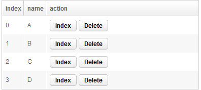

# Parameters

Retrieve Binding Parameter
==========================
ZK allows you to **pass any object or value that can be referenced by EL** on a ZUL to command method through command binding annotation. Your command method's signature should have a corresponding parameter that is
annotated with ` @BindingParam ` with the same type and key.

The syntax is:

** @command('commandName', [arbitraryKey]=[EL-expression]) **

** @global-command('commandName', [arbitraryKey]=[EL-expression]) **

**[arbitraryKey]=[EL-expression]**

The expression is optional. It's used only when you want to pass parameters to command method.

> Since 9.5.0
We can use simplified syntax to pass parameter by sequential order.
** @('commandName', [EL-expression1], [EL-expression2]) **

A Local Command Example
-----------------------
Assume we have data in grid. It's common to put a button at the end of a row to manipulate it, like delete or update. We usually need index or domain object of a row to perform a action like update.



Here is the zul of above screenshot:

#### Example to pass parameters
```xml
<grid id="outergrid" width="700px" model="@bind(vm.items)">
    <columns>
        <column label="index"/>
        <column label="name"/>
        <column label="action" width="300px"/>
    </columns>

    <template name="model" var="item">
        <row>
            <label value="@bind(itemStatus.index)"/>
            <label value="@bind(item.name)"/>
            <hbox>
                <button label="Index" onClick="@command('showIndex', index=itemStatus.index)"/>
                <button label="Delete" onClick="@command('delete', item=item)"/>
            </hbox>
        </row>
    </template>
</grid>
```
-   Line 13: We retrieve row index (Integer class) by iteration status variable and pass it with key "index".
-   Line 14: We retrieve domain object (Item class) by iteration variable and pass it with key "item".

#### Command methods in the ViewModel
```java
@Command
public void showIndex(@BindingParam("index") Integer index) {
    message = "item index: " + index;
}

@Command
public void delete(@BindingParam("item") Item item ) {
    int i = items.indexOf(item);
    items.remove(item);
    message = "remove item index " + i;
}
```
-   Line 2: Command method showIndex() should have a Integer in its argument list. We also have to specify the key "index" in ` @BindingParam `.
-   Line 7: The same as delete(), it should have a parameter with Item class in its argument list. We also have to specify the key "item" in ` @BindingParam `.

A Global Command Example
------------------------
Passing parameter in global command binding can share data among ViewModels.

The following code passes selected item to another ViewModel.
```xml
<button label="Submit" onClick="@command('submit') @global-command('detail', name=vm.selectedName)"/>
```
The global command method receives parameter through ` @BindingParam `.
```java
@GlobalCommand
public void detail(@BindingParam("name") String name) {
    //method body
}
```

Parameter Default Value
-----------------------
You could choose not to pass parameter for a command method that has parameters. The parameter will become null if you don't pass it, but you can choose to give it a default value with ` @Default `. This annotation can be used with other parameter related annotations.

#### Specify parameter's default value
```java
@Command
public void showIndex(@BindingParam("index") @Default("0") Integer index) {
    this.index = index;
}
```
-   We set index's default value to 0.

**Example to bind above command**
```xml
<label value="@bind(vm.index)"/>

<button label="button01" onClick="@command('showIndex', index=9)"/>
<button label="button02" onClick="@command('showIndex')"/>
```
-   Click button01, the label's value is 9.
-   Click button02, the label's value is 0.

You can even pass UI components. This resort can make you manipulate UI components directly but also adds a coupling between ViewModel and View which weaken the strength of MVVM pattern.

#### Example to pass a UI component
```xml
<listbox model="@load(vm.items)" selectedItem="@bind(vm.selected)" hflex="true" height="300px">
    <listhead>
        <listheader label="Name"/>
        <listheader label="Price" align="center" />
        <listheader label="Quantity" align="center"  />
    </listhead>
    <template name="model" var="item">
        <listitem onMouseOver="@command('popupMessage', target=self, content=item.description)">
            <listcell label="@bind(item.name)"/>
            <listcell label="@bind(item.price) @converter('formatedNumber', format='###,##0.00')"/>
            <listcell label="@bind(item.quantity)" sclass="@bind(item.quantity lt 3 ? 'red' : '')"/>
        </listitem>
    </template>
</listbox>
```
-   We pass listitem by implicit object "self".

#### Command method to receive UI component
```java
@Command
public void popupMessage(@BindingParam("target") Component target, @BindingParam("content") String content) {
    //method body
}
```

Retrieve Context Object
=======================
We can retrieve a value or implicit objects from various context scopes in **initial methods** (methods with **` @Init `**) and **command methods** (methods with **` @Command `**) by applying parameter related annotation on these method's parameters. We list all available HTTP context objects retrieved by parameters annotations related annotations in sections under [Parameters](../syntax/parameters.html)

Retrieve HTTP Context Object
----------------------------
#### Example to get browser information
```java
public class HttpParamVM {

    String headerParam;

    @Init
    public void init(@HeaderParam("user-agent") String browser) {
        headerParam = browser;
    }
}
```
You can apply multiple parameter-related annotations on one method's parameter, and the binder will retrieve the value among multiple context scopes in specified order. It continues to find in next context scope until it retrieves first non-null object.

#### Multiple context scope retrieval example
```java
@Init
public void init(@CookieParam("nosuch") @HeaderParam("user-agent") String guess) {
    cookieParam = guess;
}
```
-   In above example, it searches in HTTP request cookie first. If not found a non-null object, it continue to retrieve in HTTP request header.

Retrieve ZK Context Object
--------------------------
You can also receive ZK context object by `@ContextObject` with various `org.zkoss.bind.annotation.ContextType ` including [Execution](http://www.zkoss.org/javadoc/latest/zk/org/zkoss/zk/ui/Execution.html), [Desktop](http://www.zkoss.org/javadoc/latest/zk/org/zkoss/zk/ui/Desktop.html), [Session](http://www.zkoss.org/javadoc/latest/zk/org/zkoss/zk/ui/Session.html), [BindContext](http://www.zkoss.org/javadoc/latest/zk/org/zkoss/bind/BindContext.html), [Binder](http://www.zkoss.org/javadoc/latest/zk/org/zkoss/bind/Binder.html), etc. We list all available context objects you can retrieve by ` @ContextObject ` in [Syntax/ViewModel/Parameters/@ContextParam](../syntax/contextparam.html)

We retrieve current binding source component and ViewModel's view component at initial method and command method.

#### Example to retrieve ZK context object
```java
@Init
public void init(@ContextParam(ContextType.COMPONENT) Component component,
    @ContextParam(ContextType.VIEW) Component view) {

    bindComponentId = component.getId();
    bindViewId = view.getId();
}

@Command
public void showId(@ContextParam(ContextType.COMPONENT) Component component,
    @ContextParam(ContextType.VIEW) Component view) {

    bindComponentId = component.getId();
    bindViewId = view.getId();
}
```
We create 2 labels that bound to current binding component's id and view component's id.

#### A zul bound to above ViewModel
```xml
<vbox id="vbox" apply="org.zkoss.bind.BindComposer" viewModel="@id('vm') @init('eg.ContextParamVM')">
    <label id="componentId" value="@load(vm.bindComponentId)" />
    <label id="viewId" value="@load(vm.bindViewId)" />
    <button id="cmd" label="cmd" onClick="@command('showId')" />
</vbox>
```
-   When the page is loaded, component's and view's id are both "vbox". For init(), its current binding source component is vbox. As we apply @init on vbox, it's always the ViewModel's view component.
-   After clicking the button, component's id becomes "cmd" because command binding's binding source component is the button and view's id doesn't change.

Retrieve Event Object
---------------------
> Since 6.0.1 and ZK EE

> Since 6.5.2, it is supported in CE

There are two ways to retrieve an event object:

1.  Use reserved keyword **event** in ` @command ` parameter list in a ZUL.
2.  Apply annotation **` @ContextParam(ContextType.TRIGGER_EVENT) `** on a command method's parameter.

Here we have a *label* to show what a user is typing in the *textbox*. The user's typing content is stored in InputEvent's value property, so we can pass it by **event.value** when we bind a command to **onChanging** attribute.
```xml
<vbox>
    <label id="msg" value="@load(vm.message)"/>
    <textbox onChanging="@command('showTyping', v=event.value)"/>
</vbox>
```

#### ViewModel for the zul above
```java
public class EventViewModel {
    @Command
    @NotifyChange("message")
    public void showTyping(@BindingParam("v") String value, @ContextParam(ContextType.TRIGGER_EVENT) InputEvent event) {
        typingMessage = value;
        //typingMessage = event.getValue(); same effect
    }
}
```
-   The first parameter receives value from the ZUL. The second one is passed by the binder, so we don't need to specify it in the ZUL.
