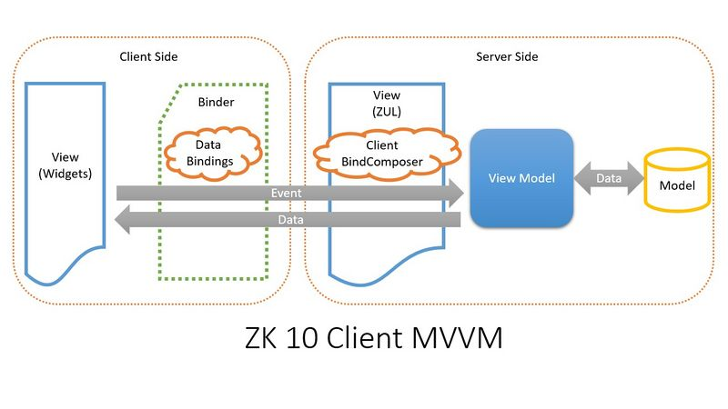

# Overview
In earlier versions like ZK 9.0, MVVM requires the creation of various server-side objects including binders and data bindings. This architecture, while functional, imposed a considerable memory footprint on the server due to the multitude of objects that needed to be maintained.

The client MVVM also starts from a ZUL and a ViewModel, but the binding information will be passed to the client-side with ZK widgets. When the widgets are created and rendered on a browser, the bindings will also be created at the same time. To clearly indicate 2 different MVVM features, we call server MVVM for the one before ZK 9. 



The introduction of client MVVM in ZK 10 represents a significant evolution in the framework, particularly in how data binding and UI component management are handled. This new approach brings notable improvements in memory usage and overall performance, primarily due to key changes in the handling of UI components and data bindings. 

Let me define these 2 MVVM features for clarity:

## Server MVVM
In ZK versions up to 9.0, involves handling most of the MVVM pattern's logic on the server side. This includes the creation and management of binders and data bindings, resulting in a substantial server memory footprint due to the numerous server-side objects that need to be maintained.

## Client MVVM
Introduced in ZK 10, represents a paradigm shift where the data binding and UI component management are largely executed on the client side. In this approach, binding information is passed to the client through ZK widgets, significantly reducing the server's memory and processing load, and enhancing overall application performance.


# Benefits
This significant shift yields two main benefits:

## Memory Reduction
When enabled, it eliminates the need to create Java objects for each UI component on the server side, with the exception of the root component tied to a ViewModel. For its child components, ZK only generates JavaScript widgets on the client side.
Client MVVM extends its memory-saving advantages beyond UI components to data bindings as well. By not creating data bindings on the server side, it substantially reduces the memory consumption on the server.

## Better Performance
With the majority of data binding operations now occurring client-side, there is a marked decrease in response time. The browser handles the binding processes, leading to quicker interactions and a smoother user experience. This shift not only saves time during the rendering process by eliminating the need to create numerous Java objects server-side but also enhances overall performance due to reduced server load.


## Using client MVVM is transparent to developers
From the perspective of an application developer, the transition to client MVVM is designed to be transparent. The fundamental method of constructing MVVM applications remains largely unchanged, and most existing data binding expressions do not require rewriting. ZK internally manages the transition, allowing developers to harness the benefits of client MVVM without extensive modifications to their existing applications. But there are still some unsupported binding usages that block you from using client MVVM, we will cover in this chapter.


# Setting up
There are two ways to use the client MVVM, either use it against a specific ViewModel, or, set it globally. Either way, you have to first include the jar file and add the listener.

## Step 1
Include the [client-bind](https://mavensync.zkoss.org/eval/org/zkoss/zk/client-bind/) jar file.

## Step 2
Add the listener for client MVVM in `zk.xml`:
```xml
<listener>
    <listener-class>org.zkoss.clientbind.BinderPropertiesRenderer</listener-class>
</listener>
```

## Step 3
### Option 1: Enable it on a ViewModel

Apply [ClientBindComposer](https://www.zkoss.org/javadoc/latest/zk/org/zkoss/clientbind/ClientBindComposer.html) with the target ViewModel a ZUL like:

``` xml
<div apply="org.zkoss.clientbind.ClientBindComposer" viewModel="..." >
    <!-- other components -->
</div>
```

### Option 2: Enable it globally

Specify [default-applied
binding composer](https://www.zkoss.org/wiki/ZK_Configuration_Reference/zk.xml/The_Library_Properties/org.zkoss.bind.defaultComposer.class) in `zk.xml` like:

``` xml
<library-property>
   <name>org.zkoss.bind.defaultComposer.class</name>
   <value>org.zkoss.clientbind.ClientBindComposer</value>
</library-property>
```

Then, you can use a ViewModel without explicitly specifying a composer:

``` xml
<div viewModel="..." >
    <!-- other components -->
</div>
```

If you enable client MVVM globally but still want to apply a different composer on a specific VM (e.g. use classic server MVVM), you can specify the `apply` attribute on that VM with your composer, and the manually specified apply will have the priority.

Once it is correctly configured, we can start to enjoy the benefits of client MVVM!

# Restrictions and Differences

With client MVVM, the data binding is now done at the client-side instead of the server-side, there are several limitations and
differences compared to the server MVVM.

## 1. EL expression is not supported

EL expression - `${expr}` and EL 3 are not supported. For Example, the following expressions are not supported:

``` xml
<label value="${expr}" />
<label value="@load(('Hi, ' += vm.person.firstName += ' ' += vm.person.lastName))" />
<label value="@load((vm.names.stream().filter(x -> x.contains(vm.filter)).toList()))" />
```

## 2. Strict Implementation of MVVM Pattern

The main feature of MVVM is to decouple the UI and non-UI code, which means components should be controlled by data binding. Developers should avoid
controlling components directly by calling their API. Even though we have this rules, there are cases where developers have been accessing the components
directly, and they used to work in server MVVM.

But now, when you enable client MVVM, ZK will update all the binding evaluation results into widget properties. This means the server-side
does not have the full and most up-to-date information. Therefore, you no longer can access and control those child components
via a Java object. You have to stick to the MVVM pattern.


Traversing components, like using `self` and `.parent` are not supported.

``` xml
<button onClick="@command('delete', index=self.parent.parent.index)"/>
```


[@Listen](https://www.zkoss.org/wiki/ZK_Developer's_Reference/Event_Handling/Event_Listening), [@Wire](../advanced/wire_components.html), [@WireVariable](../advanced/wire_components.html), and [@SelectorParam](../syntax/selectorparam.html) are not supported.
You cannot use [@BindingParam](../syntax/bindingparam.html) and [@ContextParam](../syntax/contextparam.html) to get components.

``` java
@Command
public void commandA(@BindingParam Component otherComponent,
                     @ContextParam(ContextType.COMPONENT) Component targetComponent) {
    // do something here.
}
```

Note that even though you cannot get a component, you still **can** use `@BindingParam` to retrieve values and other `ContextType`.

``` xml
<button label="click it" onClick="@command('commandB', foo='something', bar='somethingelse')" />
```

``` java
@Command
public void commandB(@BindingParam("foo") String foo,
                     @ContextParam(ContextType.PAGE) Page page,
                     @ContextParam(ContextType.DESKTOP) Desktop desktop) {
    // do something here.
}
```


Component related API might return null (no component on the
    server-side).

``` java
@Command
public void commandB(@ContextParam(ContextType.TRIGGER_EVENT) MouseEvent event) {
    // event.getTarget() is null.
    // event.getPageX()/event.getPageY()/.. are still available.
}

// the component is null
org.zkoss.bind.Converter#coerceToUi(B beanProp, C component, BindContext ctx);
org.zkoss.bind.Converter#coerceToBean(U compAttr, C component, BindContext ctx);
```


## 3. Deferred Binding is no longer supported

Deferred Binding is no longer supported. This feature is to avoid
unnecessary AU requests (data updates). Since client MVVM does those
bindings on the client-side, it doesn't require such an update.

``` xml
<textbox value="@bind(vm.text1)">
    <custom-attributes org.zkoss.bind.event.deferPost="false"/>
</textbox>
```

## 4. SmartNotifyChange always on

`@SmartNotifyChange` is always enabled in client MVVM, which means that the
properties will only update (reload) when the value of the expression is
changed.

## 5. Conditional Binding works differently

Conditional binding works differently when the command updates the value
without doing `@NotifyChange`. For example:

``` xml
<label value="@load(vm.text, after='doChange')" />
<button label="Do Change" onClick="@command('doChange')" />
```

``` java
public String text = "123";
@Command
public void doChange() {
    this.text += "changed";
}
```

In server MVVM, the value of Label will be "123changed" after the "Do Change" button is clicked.

In client MVVM, the value will remain "123". If you intend to see
"123changed" you will need to apply `@NotifyChange`.


## 6. AnnotateDataBinder and Calling Binder API are no longer supported
`AnnotateDataBinder` is the old ZK binding in zkplus module. And the
Binder API is for server MVVM. For example:

``` xml
<window id="myWin" viewModel="@id('vm') @init('...')">
    <button id="changeNameBtn" label="change name">
        <attribute name="onClick"><![CDATA[
        myWin$composer.getViewModel().setName("...");
        myWin$composer.getBinder().loadComponent(myWin, true);
    ]]></attribute>
    </button>
</window>
```

Or using custom Binder:

``` xml
<window viewModel="..." binder="@id('mybinder') @init(vm.binder)">
</window>
```

All those usages are not support with client MVVM.

<!--
## 3. Getter Method should be pure in View Model

To send those data of the view model to the client side, client MVVM depends on the getter methods to retrieve data.

For example, the return value of a getter method should not be always a
"new" object.
-->

# Client MVVM Linter - a checking tool

[ZK Client MVVM
Linter](https://blog.zkoss.org/2023/08/01/zk-10-preview-introducing-zk-client-mvvm-linter/)
can scan your zul and java files to find out those unsupported MVVM usages under client MVVM enabled. See [linter starter](https://github.com/zkoss-demo/zk-client-mvvm-linter-starter/tree/master) know how to use it. 


# Debugging Tips

Unsupported/incompatible usages mentioned in the previous section will be reported as system logs during the application startup, remember to check the logs when running into issues using the client MVVM.

# Upgrade Tips

- Migrating server MVVM to client-side MVVM is generally straightforward, except for cases where unsupported usages are involved.
- You can selectively enable client MVVM for specific ViewModels, allowing gradual integration rather than an all-at-once approach.
- Consider updating your code to address any incompatibilities, especially if the performance and memory improvements of client MVVM are significant for your application.
- Client-side MVVM is an optional feature in ZK 10. You can upgrade to ZK 10 without adopting client MVVM immediately, continuing to use the server MVVM as needed.

# Supported features
Client MVVM can transparently support server MVVM features below: 

* form binding
* children binding
* reference binding
* converter
* validator
* global command
* shadow elements
* ROD


# Right feature for the right Job
As mentioned above the core benefit of using client MVVM is to save the server memory and improve performance. Instead of spending the time checking the limitations and upgrading client MVVM throughout the whole project, we recommend you apply client MVVM to the following pages:

* pages with massive load bindings or save bindings
* pages visited by a large number of concurrent users

Both scenarios produce more binding tracker nodes, so applying client MVVM to these cases can effectively reduce the memory footprint.


# FAQ

## What if I am currently mixing MVC and MVVM, can I apply client MVVM?
With client MVVM, ZK doesn't create those child components at the server-side (no Java objects for ZK components created). Therefore, you can no longer access and control components as a server-side component. We'd recommend you either:

1. keep using server MVVM
2. refactor your code to follow the MVVM pattern strictly, then turn it into client MVVM

## How much improvement I can expect?
It depends on the number of components and the type and amount of bindings you are currently using. You need to do a profiling to know the difference.


## How is client MVVM different from fragment?
* [fragment](https://www.zkoss.org/wiki/ZK%20Component%20Reference/Containers/Fragment) integrates Vue framework.

Since Vue supports different data binding syntax from ZK MVVM, not all features can be integrated with ZK. The integration focuses on supporting basic and commonly shared data binding syntax.

* client MVVM aims to support all server MVVM features

Hence, it can support a more complete set of data-binding syntax and behavior. Also, it allows you to migrate your existing server MVVM to client MVVM easily.

## Is client MVVM specific for clustering environment?
The client MVVM is not specifically designed for a clustered environment, it has the same level of clustering support as server MVVM. It still keeps the Desktop and some component states in a server. When deploying to a clustering environment, you still need to follow the instructions in [ZK Developer's Reference/Clustering](https://www.zkoss.org/wiki/ZK_Developer%27s_Reference/Clustering).