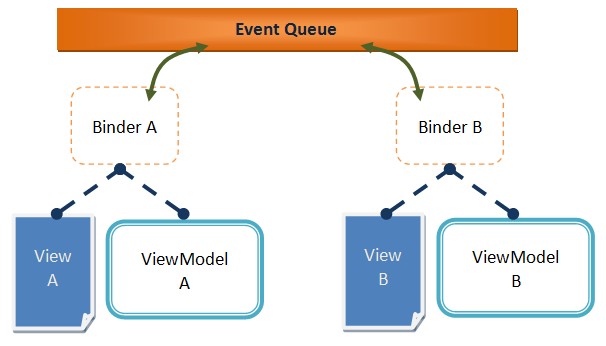

# Binder
The [Binder](http://www.zkoss.org/javadoc/latest/zk/org/zkoss/bind/Binder.html) is the key in the whole data binding mechanism. When we apply a [BindComposer](http://www.zkoss.org/javadoc/latest/zk/org/zkoss/bind/BindComposer.html) on a component, it will create a binder and pass component's and ViewModel's object reference to the binder.

Binder parses ZK bind annotations on ZULs to establish data binding relationship between components and ViewModel. It also synchronizes data between ZUL(View) and ViewModel based on the binding relationship and forwards events to ViewModel's command method.

Typically ViewModel is just a POJO. As it has no knowledge about others, a ViewModel can only communicate with another one by binder. The binder
is like a broker and uses ViewModel's meta data(annotation) and methods to help it communicate with others. **By default a binder subscribes to a desktop-scoped event queue**, thus event queue is a common communication mechanism among binders. There are 2 features: [global command binding](./global_command_binding.html) and [dynamic change notification](../viewmodel/notification.html) that operate based on this mechanism.



ZK also allows you to change default queue name and scope that a binder subscribes. You can separate binders into different groups by changing queue's name and scope upon your requirement.The syntax is as follows:
```xml
<window apply="org.zkoss.bind.BindComposer" viewModel="@id('vm') @init('foo.MyViewModel')"
    binder="@init(queueName='myqueue')">


<window apply="org.zkoss.bind.BindComposer" viewModel="@id('vm') @init('foo.MyViewModel')"
    binder="@init(value='xxx.MyBinder', queueScope='session')">
```
For available scopes, please refer [ZK Developer's Reference/Event Handling/Event Queues](http://books.zkoss.org/wiki/ZK_Developer%27s_Reference/Event_Handling/Event_Queues).

For binder class customization(This feature is reserved for framework architect, NOT recommended for app developer!), your implementation must extends [AnnotateBinder](http://www.zkoss.org/javadoc/latest/zk/org/zkoss/bind/AnnotateBinder.html)
