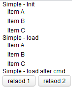
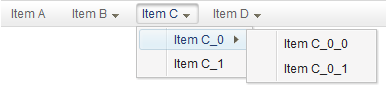

# Children Binding

Create Children Dynamically with Template
=========================================
Children binding allows us to bind child components to a collection then we can create a group of similar components dynamically upon the collection with `<template>`. Typically we also can do this by listbox or grid, but they have fixed structure and layout. With this feature we can create child components more flexible, like: a group of checkbox that options comes from a list, or dynamic generated menuitems.

Steps to use this feature:
1.  Create a **` List ` object** as a ViewModel's property.<sub>[1]</sub>
2.  Bind a parent component's **children** attribute with ` @init ` or ` @load ` to the ViewModel's property
3.  Use ` <template> ` to enclose child components and set its **name** attribute to **children**. Because children binding chooses the default template with name **children**.

[1]: It must be a ` List ` object under CE edition.

#### Basic usage example
```xml
<window apply="org.zkoss.bind.BindComposer" viewModel="@id('vm') @init('foo.ChildrenSimpleVM')">
    Simple - Init
    <vlayout id="init" children="@init(vm.nodes)">
        <template name="children" var="node">
            <label value="@bind(node.name)" style="padding-left:10px"/>
        </template>
    </vlayout>
    Simple - load
    <vlayout id="load" children="@load(vm.nodes)">
        <template name="children" var="node">
            <label value="@bind(node.name)" style="padding-left:10px"/>
        </template>
    </vlayout>
    Simple - load after cmd
    <vlayout id="aftercmd" children="@load(vm.nodes, after='cmd')">
        <template name="children" var="node">
            <label value="@bind(node.name)" style="padding-left:10px"/>
        </template>
    </vlayout>
    <!-- other components -->
</window>
```

#### Basic usage screenshot


Combine with Dynamic Template
=============================
If you combine this feature with dynamic template, you can even render different child components upon different conditions.

Here is an example to create a dynamic menu bar. If a menu item has no sub-menu, we use menuitem otherwise we use menu.
#### An example of dynamic menu bar
```xml
    <menubar id="mbar" children="@bind(vm.nodes) @template(empty each.children?'menuitem':'menu')">
        <template name="menu" var="node">
            <menu label="@bind(node.name)">
                <menupopup children="@bind(node.children) @template(empty each.children?'menuitem':'menu')"/>
            </menu>
        </template>
        <template name="menuitem" var="node">
            <menuitem label="@bind(node.name)" onClick="@command('menuClicked',node=node)" />
        </template>
    </menubar>
```
#### Dynamic menu bar screenshot



Default Converter for Children Binding
======================================
> Avaliable for ZK: EE

> Since 6.0.1

Users usually bind attribute “children” to a `Collection` object, but you can also bind it to a ` Array `, ` Enum `, even an ` Object `. An implicit default converter will convert them to a ` Collection ` object. Certainly, you can apply your customized converter and we will talk about it at [Data Binding/Converter](./converter.html)
