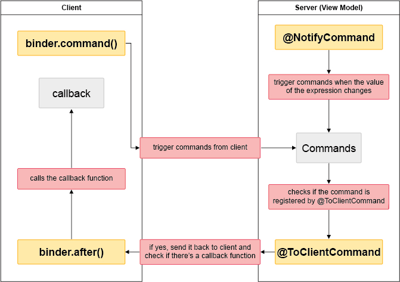

# Client Binding


> Since 8.0.0

To interact with client side libaries, **Client Binding** can help us to publish a ZK’s data binding command on a native html element.
For example, you can publish a *doClick* command in your view model with an *onClick* event in a html Button.

### Implementation

**Client Binding** provides 4 methods - 2 at the client side, and 2 at the server side. Their relationships can be illustrated by the following diagram:



#### At client side

First, we have to get the client binder in order to use the client side methods. To get the binder, simply use :

```javascript
var binder = zkbind.$('$id');
```
After we have our client binder, we could use the following two methods to interact with the view model back to our server.

**Method 1 - command**

```javascript
binder.command(commandName, data);
```
This method is used to trigger a command we have at server.

**Parameters**
-   `commandName` - Command name at server side (ViewModel).
-   `data`- JavaScript object, to pass any information you want with the command.

**Note : ** You could also pass ZK widgets in the data object and use @BindingParam to get the corresponding ZK component at the server.

**Method 2 - after**

```javascript
binder.after(commandName, callback);
```
This method is used to place a callback at the client after a command gets executed at the server.

**Parameters**
-   `commandName` - Command name at server side (ViewModel).
-   `callback`- Callback function after the command gets executed at the server.

#### Server Side

In server side, we can use the following two annotations for the client side binding. They should be placed at the beginning of the class declaration of our View Model.

**Annotation 1 - NotifyCommand**

```java
@NotifyCommand(value="commandName", onChange="_vm_.expression")
```

The notify command annotation allows us to trigger a command whenever the given expression changes at the server. Notice the command which gets triggered is a command in our view model. The `_vm_` here means the current view model.

**Annotation 2 - ClientCommand**

```java
@ClientCommand(commandNames)
```

The client command annotation allows us to put which commands we want to notify the client after execution has been done. Notice only the commands we put inside this annotation will trigger the callback we put in *binder.after* at client.

###Examples
There are two examples using client binding:
- ZK Blog :[
ZK8: Work with Polymer Components using ZK’s new client side binding API](http://blog.zkoss.org/index.php/2015/03/11/zk8-work-with-native-web-components-using-the-new-zk-client-side-data-binding-api/)
- ZK Small Talk :[ZK8 Series: Interact with Client Side Libaries using ZK's New Client Side Binding](http://books.zkoss.org/wiki/Small_Talks/2015/April/ZK8_Series:_Interact_with_Client_Side_Libaries_using_ZK8%27s_New_Client_Side_Binding)

