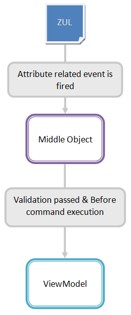
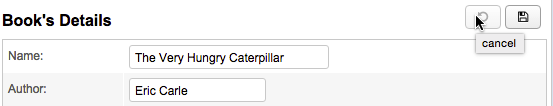
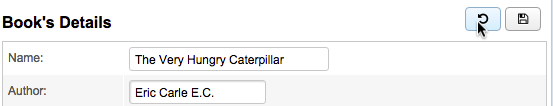

# Form Binding

Overview
========
Form binding is like a buffer. It automatically creates a middle object. Before saving to ViewModel all input data is saved to the middle object. In this way we can keep dirty data from saving into the ViewModel before
user confirmation. Assuming a user fills a form in a web application, user input data is directly saved to ViewModel's properties, the target object. Then the user cancel the filling action before submitting the
form, thus the data stored in ViewModel is deprecated. That would cause trouble if we further process the deprecated data, so developers might store input data in a middle place first then move to real target object
after the user confirms it. Form binding provide a middle object to store unconfirmed input without implementing by yourself.

Form binding can keep target object in ViewModel unchanged before executing a Command for confirmation. Before saving to ViewModel's properties (target object) upon a Command, we can save input in Form binding's middle object. When the command is executed (e.g. button is clicked), input data is really saved to ViewModel's properties. Developers can achieve the whole process easily just by writing ZK bind expression and it reduces developer's burden of cleaning dirty data manually or implementing buffer himself.

#### The data flow among ZUL, middle object, and the target object is illustrated below:



Steps
-----
1. Give an id to middle object in form attribute with ` @id `.
    * You can reference the middle object in ZK bind expression with id.
2. Specify ViewModel's property to be loaded with ` @load `
3. Specify ViewModel's property to save and before which Command with ` @save `
    * This means binder will save middle object's properties to ViewModel before a Command
4. Bind component's attribute to middle object's properties like you do in property binding.
    * You should use middle object's id specified in ` @id ` to reference its property.

An example using property binding :
```xml
<groupbox >
    <grid hflex="true" >
        <columns>
            <column width="120px"/>
            <column/>
        </columns>
        <rows>
            <row>
                Id <label value="@load(vm.currentBook.id)"/>
            </row>
            <row>
                Name <textbox value="@bind(vm.currentBook.name)"/>
            </row>
            <row>
                Author <textbox value="@bind(vm.currentBook.author)"/>
            </row>
            <row>
                Price <doublebox value="@bind(vm.currentBook.price)" format="###,##0.00" />
            </row>
        </rows>
    </grid>
</groupbox>
```
- The input data is directly saved to properties of vm.currentBook. No middle object.

The same example but using form binding:
```xml
<groupbox form="@id('fx') @load(vm.currentBook) @save(vm.currentBook, before='save')">
    <grid hflex="true" >
        <columns>
            <column/>
            <column/>
        </columns>
        <rows>
            <row>
                Id <label value="@load(fx.id)"/>
            </row>
            <row>
                Name <textbox value="@bind(fx.name)"/>
            </row>
            <row>
                Author <intbox value="@bind(fx.author) "/>
            </row>
            <row>
                Price <doublebox value="@bind(fx.price)" format="###,##0.00" />
            </row>
        </rows>
    </grid>
</groupbox>
```
- We give an id: ` fx ` to the middle object. (line 1)
- The properties of `fx` we can access are identical to vm.currentBook. (line 9, 12, 15, 18)
- Binder saves input data into `fx`, middle object, when each time a user triggers an onChange event. When clicking a button bound to Command 'save', it will save middle object's data to `vm.currentBook`.

Form Proxy Object
-------------
Form binding automatically creates a middle object for you to store properties from ViewModel's object you specified.
It can deeply support these types - **Collections**, **Map**, and **POJO** in a form concept, as a proxy object for developers to manipulate them when users edit data in the form field. 
Once the form is submitted, all the edited data will be synchronized back to the original data object.

Continue above example, we define a **Collections** property in the user bean.

Book.java:
```java 
public class Book {
    // ... (id, author, name, price)
    
    // collection property
	private Set<Category> categories = new LinkedHashSet<Category>();
	
	public Book() {} //used for proxy to access
	
	//... getters and setters
}
```
Category.java:
```java
public class Category {
	private String name;
	public Category() {} // used for proxy to access
	
	//... getters and setters
	
	public int hashCode() {
		String name = getName();
		if (name == null)
			return 0;
		return name.hashCode();
	}
	public boolean equals(Object obj) {
		if (obj == null)
			return false;
		if (obj instanceof Category) {
			String oname = ((Category) obj).getName();
			String name = getName();
			if (oname == null)
				return name == oname;
			else
				return oname.equals(name);
		}
		return false;
	}
}
```

Note:
- The proxy mechanism follows the Java Proxy contract, so the user bean classes need to provide an **empty constructor** for the proxy mechanism to use.
- In the methods **hashcode** and **equals**, we cannot directly use the instance field to check, because the proxy object can be only handled by the method invocation, not the instance field. For example, use getName() instead of this.name.

And we use some commands to add/remove a Category.

In VM.java:
```java
@Command("addCategory")
public void doAddCategory(@BindingParam("form") Book form,
		@BindingParam("cateName") String cateName) {
	Set<Category> categories = (Set<Category>) form.getCategories();
	categories.add(new Category(cateName));
}

@Command("removeCategory")
public void doRemoveCategory(@BindingParam("form") Book form,
		@BindingParam("category") Category cate) {
	Set<Category> categories = (Set<Category>) form.getCategories();
	categories.remove(cate);
}
```
The form proxy would synchronize back the edited data (`Category`) after the form submitted.

Notice that the form proxy would cache all the properties in the user bean. You can use `@Transient` to mark  an element transient, and the element would not be cached.

```java
public class Pojo {
    //... other properties
    public Pojo() {} //used for proxy to access
    @Transient
	public long getAreal() {
		return (long)getWidth() * getHeight();
	}
}
```
Because the result of `getAreal()` is a calculation, we don't need to cache the calculated value.

### Reset Methods
Form proxy object provides 9 built-in methods transparently for developers to clean up the component value as follows.

- resetEmptyStringValue: returning an empty string value
- resetNullValue: returning a null value
- resetByteValue: returning a byte value (0)
- resetShortValue: returning a short value (0)
- resetIntValue: returning an int value (0)
- resetLongValue: returning a long value (0L)
- resetFloatValue: returning a float value (0.0f)
- resetDoubleValue: returning a double value (0.0d)
- resetBooleanValue: returning a boolean value (false)
- resetCharValue: returning a char value (‘\u0000′)

For example:
```xml
<hlayout>
        Add Category
        <textbox width="150px" 
          value="@load(fx.resetEmptyStringValue, after={'addCategory', 'cancel'})" />
        <a iconsclass="z-icon-plus-circle" 
          onclick="@command('addCategory', form=fx, cateName=self.previousSibling.value)"></a>
</hlayout>
```


 

Form Status Variable
====================
Form binding also records middle object's modification status.It’s a common requirement for users to know that whether they have modified a form’s data (dirty status) or not, developers therefore add a feature that would remind users of this with an UI effect. For example, some text editors appends a star symbol ‘*’ on the title bar to remind users of modified text file. “Form binding” preserves the dirty status in an variable that we can utilize it.

Dirty status is stored in an auto-created **form status variable** with a naming convention of:

`[middleObjectId]Status`

Continue above example, we add an exclamation icon right next to Id value. If users modify any input data, the ex exclamation icon will show up.
```xml
<groupbox form="@id('fx') @load(vm.currentBook) @save(vm.currentBook, before='save')" >
    <grid hflex="true" >
     ...
    </grid>
    <button iconSclass="z-icon-undo" disabled="@load(not fxStatus.dirty)" 
       tooltiptext="cancel" visible="@load(vm.editable)" onClick="@command('cancel')" />
    <button iconSclass="z-icon-save" tooltiptext="submit" onClick="@command('save')" />
</groupbox>
```
-   In this example, form status variable is `fxStatus ` for the form’s id is ` fx `. Its **dirty** property indicates that whether the form has been modified by users or not.





After users modify a field, the cancel button would be enabled.

Form

Form Validation
===============
Before saving data to form's middle object, we also can validate user input with validator. Please refer to [Data Binding/Validator](./validator.html).
