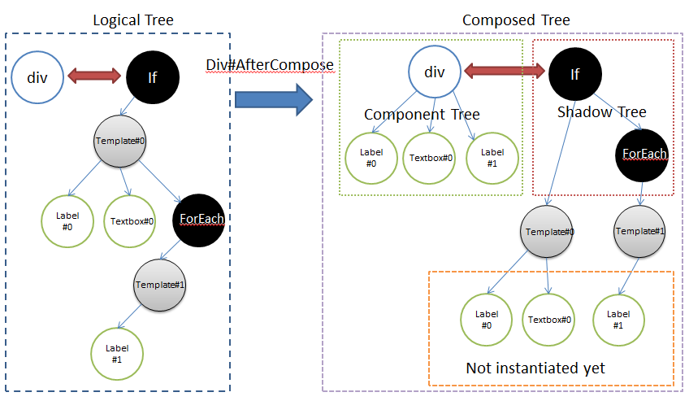

# Shadow Elements

# Overview
A shadow element is like a boilerplate code to help application developers compose the html layout with some dynamic data. It is inspired from [Shadow DOM](http://w3c.github.io/webcomponents/spec/shadow/) to enable better composition of ZK components and support the ZK DataBinding (MVVM) mechanism. A web designer can pre-define a template based on HTML syntax for application developers to use. Technically, shadow elements are not visible while application developers manipulate ZK component's tree as explained below.

For example,

```xml
<div>
    <if test="@load(user.editable)">
        User Name: <textbox value="@load(user.name)"/>
        <forEach items="@load(user.phones)" var="phone">
            <label value="@load(phone.number)"/>
        </forEach>
    </if>
</div>
```


As shown in the diagram above, the tree is separated into two parts - **Logical Tree** and **Composed Tree**.
- **Logical Tree** is created by ZK page parser to construct a page definition tree and then instantiate it into a **Composed Tree**.
- **Composed Tree** is also separated into two parts, one is the component tree (green area) which is the same as before, and the other is the new concept (red area) shadow tree, which is not visible for application developers but component developers.

The shadow tree in the example above with EL expression won't be alive once the output is rendered to the client. This is because shadow elements are not applied with dynamic data such as @load expressions, so there is no reason to store them on the server side to burden the memory consumption.

# Setup
Before using shadow elements, make sure you include the required jar - `zuti.jar`. With maven, you should add the dependency below:
```xml
    <dependency>
        <groupId>org.zkoss.zk</groupId>
        <artifactId>zuti</artifactId>
        <version>${zk.version}</version>
    </dependency>
 ```
 
# Shadow Element Tags

- **Apply**: executable tags to allow you to choose which template is to be applied, it will lookup the template inside-out recursively.
- **ForEach**: allows you to iterate over a collection of objects. Specify the collection by using the items attribute, and the current item is available through a variable named by the var attribute.
- **Choose/When/Otherwise**: performs conditional block execution by the embedded <when> subtags. It renders the body of the first <when> tag whose test condition evaluates to be true. If none of the test conditions of nested <when> tags evaluate to be true, the body of an <otherwise> tag is evaluated, if present.
- **If**: allows the conditional execution of its body according to the value of the test attribute.
Note: you can customize your own shadow elements if required.

We can use shadow components anywhere on a zul. For example, create a component upon a condition:

```xml
<if test="@load(vm.readonly)">
    <button label="Edit"/>
</if>
```
Or create a collection of components:

```xml
<forEach begin="0" end="3">
    <button label="${'Button'+=each}"/>
</forEach>
```
