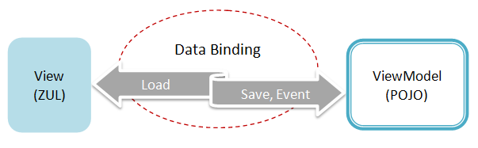
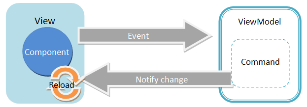

# ViewModel

# What is ViewModel
ViewModel is an **abstraction of Model**. It extracts the necessary data to be displayed on the View from one or more Model classes. Those data are exposed through getter and setter method like JavaBean's property.

ViewModel is also a **Model of the View**. It contains the View's state (e.g. selection, enabled status) that might change during user interaction. For example, if a button is enabled when a user selects an item of a listbox. ViewModel shall store the state of the button's enabled status and implement the logic to enable the button.

Although ViewModel stores the View's states, it contains no reference to UI components. It can not access any UI components directly. Hence, there is a data binding mechanism to synchronize data between View and ViewModel. After developers define the binding relationship between View (UI component) and ViewModel, the data binding mechanism synchronize the data automatically. This makes ViewModel and View loosely coupled.



ViewModel acts like a Controller in MVC, so the data binding mechanism forwards events to ViewModel's handlers. The handlers are ViewModel's method with specific Java annotation. We call such a method **Command** of the ViewModel. These methods usually manipulate data of the ViewModel, like deleting an item. Data binding mechanism also supports binding a UI component's event with a ViewModel's command. Firing the component's event will trigger the execution of bound command, invoking the annotated method.

During the execution of command, it usually changes the data of ViewModel. The developer should specify what properties change to be notified through Java annotation.



the UI sometimes has to display data in a different format from original one in the Model. The converting logic shall be implemented in ViewModel or developers can adopt a more reusable element **converter** that we will talk about in a [later section](../data_binding/converter.html).

Validation will also be performed before saving data into ViewModel. If validation fails, the data will not be saved to ViewModel.

# ViewModel with Annotation
In ZK, ViewModel can be simply a **POJO**, and it knows nothing about View's visual elements which means it should not hold any reference to UI components. The data binding mechanism handles communication and synchronization between View and ViewModel. Developers have to specify command and data dependency of a ViewModel with ZK provided Java annotation, then data binding mechanism will know how to interact with the ViewModel.

Creating a ViewModel is like creating a POJO, and it exposes its properties like JavaBean through setter and getter methods.

```java
public class MyViewModel {
	private String name;

	public String getName() {
		return name;
	}

	public void setName(String name) {
		this.name = name;
	}

	@NotifyChange({"selected", "orders"})
	@Command
	public void newOrder() {
		//manipulate data
	}
}
```

* We'll describe above annotation in detail at [ViewModel/Notification](./notification.html)

# Reference a ViewModel in a ZUL
We can bind ZK UI component to a ViewModel by setting its **viewModel** attribute, and that component becomes the **Root View Component** for the ViewModel. All child components of this Root View Component can access the same ViewModel and its properties. To bind a ViewModel, we have to apply a composer called **org.zkoss.bind.BindComposer**, it will create a binder for the ViewModel and instantiate the ViewModel's class. Using ZK Bind annotations then we set **viewModel** attribute with the ViewModel's id in `@id` and the ViewModel's full-qualified class name in `@init` . The id is used to reference ViewModel's properties, e.g. vm.name, whilst the full-qualified class name is used to instantiate the ViewModel object itself. We'll explain ZK Bind annotation syntax in detail at subsections of [Data Binding](../data_binding/).

```xml
<window apply="org.zkoss.bind.BindComposer" viewModel="@id('vm') @init('foo.MyViewModel')">
    <label value="@bind(vm.name)"/>
    <button onClick="@command('newOrder')" label="New Order" />
</window>
```
